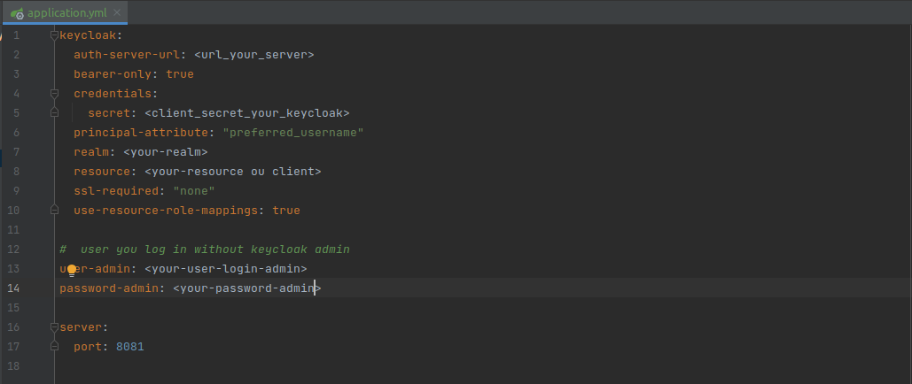
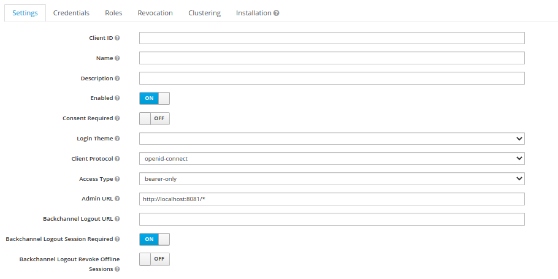
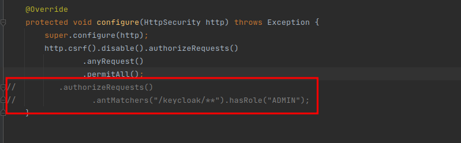

# KEYCLOAK ADMIN REST EXAMPLE SIMPLE

* create user
* update user
* send email verify user
* send email forgot password user
* logout
* getUsers
* config roles
* more

## how to use?

### configure properties using your keycloak

### Client Config

## important

### remember these requests have no protection so anyone could access, you can break this by creating an ADMIN role in keycloak and setting wheel protection in keycloak config, example below.

### But before doing that create ROLE ADMIN in keycloak.
