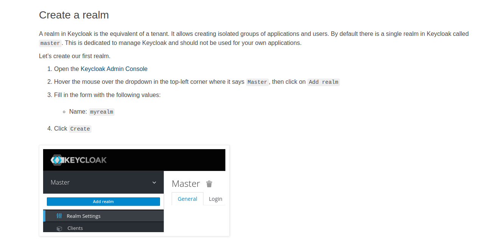

# KEYCLOAK ADMIN REST EXAMPLE SIMPLE

* create user
* update user
* send email verify user
* send email forgot password user
* logout
* get users
* config roles
* more

## how to use?

### configure properties using your keycloak


## Start Keycloak

```rust
docker run -p 8080:8080 -e KEYCLOAK_USER=admin -e KEYCLOAK_PASSWORD=admin quay.io/keycloak/keycloak:15.0.2
```

### How to create a Realm, see the documents. (It's quite simple)


#### source

```rust
https://www.keycloak.org/getting-started/getting-started-docker
```

## create a client

### Why bearer-only?

#### Bearer-only access type means that the application only allows bearer token requests. If this is turned on, this application cannot participate in browser logins.

#### So if you select your client as bearer-only then in that case keycloak adapter will not attempt to authenticate users, but only verify bearer tokens. That why keycloak documentation also mentioned bearer-only application will not allow the login from browser.
### Client Config


## important

### remember these requests have no protection so anyone could access, you can break this by creating an ADMIN role in keycloak and setting wheel protection in keycloak config, example below.


### But before doing that create ROLE ADMIN in keycloak.
