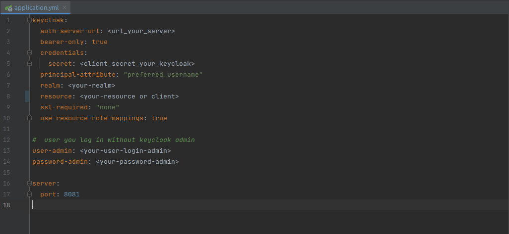

# KEYCLOAK ADMIN REST EXAMPLE SIMPLE

* create user
* update user
* send email verify user
* send email forgot password user
* logout
* get users
* config roles
* more

## how to use?

### configure properties using your keycloak

### Client Config

## important

### Remember, the requests are then public, so when going up to production anyone could access, one way to protect yourself is by using 'antMatchers', and creating the 'ADMIN' role in the keycloak, as shown in the example below.

### But before doing that create ROLE ADMIN in keycloak.
